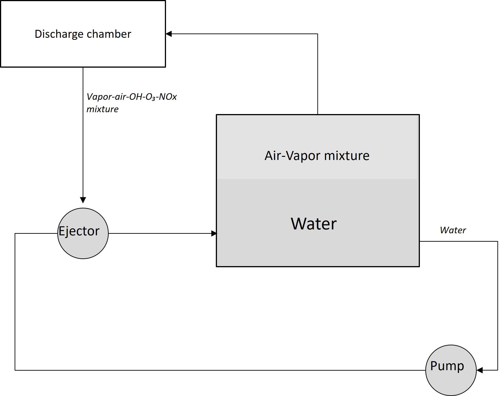

# Project Demetra

## Nitrogen Fixation in Gas Discharge: Fundamentals

### Historical Sketch
Attempts to use gas discharge to synthesize nitrogen fertilizers were made more than 100 years ago. The Birkeland-Eyde process used arc discharge to produce NO, which was then converted into nitric acid. 
However, the Birkeland-Eyde process lost competition to the Haber-Bosch process, as it consumed 60-80 kWh/kg N.

In recent years, interest in plasma-based nitrogen capture has been growing. While theoretical advancements have been made, the practical implementation of plasma-based methods remains close to the Birkeland-Eyde process in terms of energy efficiency and scalability.

The importance of more efficient, affordable, and sustainable nitrogen fertilizers cannot be overstated. The use of synthetic nitrogen fertilizers is directly responsible for sustaining nearly half of the world's population.

However, the Haber-Bosch process accounts for about 1-2% of global energy consumption and is responsible for 1-2% of greenhouse gas emissions from ammonia production and distribution alone. Moreover, the centralization of the nitrogen fertilizer market—primarily concentrated near natural gas extraction sites—reduces the resilience of food supply chains in developing countries, where both access to fertilizers and their efficient use remain major challenges.

This document describes a method to create a highly efficient plasma generator capable of synthesizing **NO3-** in water with energy efficiency comparable to the Haber-Bosch process.


### Step-by-Step process
Nitrogen is the primary component of air, comprising approximately 78% of its mass. However, the main challenge is that N₂ is an extremely strong and stable molecule due to its triple bond, which is difficult to break.

The triple bond is not only strong, but the cross-section of direct electron impact dissociation is negligible (due to certain quantum mechanical restrictions). That is why, for example, one can't find the N₂ dissociation cross-section in the LXCAT database.

Let's start at the end. We need the NO₃⁻ ion in liquid, which is obtained by oxidizing NO₂⁻, given a high concentration of O₃ and O₂.
NO₂⁻ is the product of HNO₂ dissociation in water. HNO₂ has medium solubility, but under certain conditions (described below), it can dissolve quite quickly:
```
HNO₂ → H⁺ + NO₂⁻
```
The fastest way to generate HNO₂ is:
```
NO + OH + M → HNO₂ + M, k = 2.16E-17, for N = 2.7E25 (a very fast reaction!)
```
So we need NO and OH.

Let's focus on NO. NO is the Holy Grail of nitrogen capture; all plasma-based nitrogen capture technologies somehow focus on NO production.

In the 1940s, Soviet physicist Zeldovich described in detail the formation of NO in an N₂/O₂ mixture via the following mechanism:
```
N₂ + O → NO + N, k = 3.0E-16 exp(-38300/T)  (1)

O₂ + N → NO + O, k = 4.5E-17 exp(-3272/T)   (2)
```
Under typical conditions in discharge channel (~1000–2000 K), reaction (2) is approximately million times faster. Most researchers focus on [2], but this is a trap.

N₂ is a highly stable molecule with a very strong triple bond. To break it, we need to supply two electrons to generate two N atoms:
```
N₂ +  e → N₂+ + 2e, Ee > 15.6 eV (rare in gas discharge)

N₂+ +  e → N + N
```
This drastically reduces overall energy efficiency, which is why the Birkeland–Eyde process lost to the Haber–Bosch process.

However, accelerating reaction [1] is not only possible but also relatively straightforward. Excited N₂ molecules, which are abundant in gas discharges, significantly enhance reaction [1].

For example, vibrational states with v > 7–8 accelerate [1] by up to 100,000 times, making it comparable to [2]

Finally, the most efficient way to break N₂ is:
```
N₂* + O → NO + N
```
with an additional bonus:
```
N + OH → NO + H
```
Thus, if we have excited N₂*, atomic oxygen, and OH, we can efficiently obtain two NO molecules.

Surprisingly, N₂* is not a problem in gas discharge, as about 50–70% of discharge energy is utilized for N₂ excitation. For an efficient Zeldovich reaction, vibrational levels of metastable A³ (and higher) states at 3–4+ are sufficient.

But the real challenge is oxygen. Atomic oxygen is obtained through the reaction:
```
O₂ + e⁻ → O(¹D) + O(³P), Eₑ > 8.4 eV
```
The second, more efficient reaction:
```
O₂ + e⁻ → O(³P) + O(³P), Eₑ > 6.2 eV
```
unfortunately has a significantly lower cross-section.

Taking into account that air consists of ~22% O₂ and 78% N₂, and that the N₂ excitation reaction consumes 2–3 times less energy than O₂ dissociation, we always face an oxygen deficit.

For every 5–6 N₂* molecules, we have only one O atom.

**Oxygen deficit is the main problem of plasma-based nitrogen capture.**

This statement is not entirely novel but is often overlooked in the literature.

To solve the oxygen deficit problem, we need a way to transfer energy from N₂* to O₂. Fortunately, we have one:
```
N₂(A³) + O₂ → O + O + N₂, k = 5E-18 × exp(-210/T)
```
This reaction is even more probable than the Zeldovich process, considering that O₂ concentration is much higher than O concentration. Approximately 70% of N₂(A³) reacts with O₂, generating atomic oxygen (while the remaining 30% produces O₂(a¹)).

The next question is: how can we direct more energy into N₂(A³) excitation rather than into N₂(v=1..5)?
BOLSIG+ provides a clear answer—increase the mean electron energy to 4–5 eV. For example, when the mean Eₑ = 2 eV, only 16% of the total discharge energy goes into N₂(A³) excitation, compared to 53% when Eₑ = 5 eV.

However, Eₑ > 5 eV is not typical in gas discharges at atmospheric pressure, because the self-consistent electric field directly limits electron energy.

**The final challenge – how to overcome the self-consistent electric field limitation?**

Surprisingly, the solution is relatively simple: introducing water vapor into the discharge zone at a concentration of approximately 30–40% of the total molecular content. This results in a humid, warm air stream at ~60–70°C.

However, this statement requires a more detailed explanation. Consider a simple drift-diffusion model.

**Continuity Equations**


where

 - electron and gas densities

 - ionization and attachment frequencies


**Flux Equations**

 

where

 - diffusion and mobility coefficients

In a medium with a high concentration of H₂O molecules, the diffusion and mobility coefficients decrease significantly due to the high cross-section of rotational excitations in water molecules.


*Diffusion and Mobility in Dry [0% H2O] and Wet Air [37% H2O] - BOLSIG+ Itikawa and Lisbon Databases, including N₂ and O₂ rotational states*

From a physical intuition perspective, based on the **Continuity Equations**, electron density and the resulting self-consistent field are predominantly governed by ionization and attachment processes rather than by flux dynamics.


*Total Townsend Coefficients in Dry [0% H2O] and Wet Air [37% H2O] - BOLSIG+ Itikawa and Lisbon Databases, including N₂ and O₂ rotational states*

Fortunately, in heavily humidified air, the Townsend balance (i.e., the ratio of ionization to attachment rates) shifts favorably, with ionization exceeding attachment by a factor of 2–3 at approximately 5 eV.

As a result, in such an environment, the discharge naturally optimizes itself within the region of maximal NO generation efficiency.

**TBD – Demonstrate a 2D Plasma Drift-Diffusion model to prove physics intuition**

**Final Bonus**
In the presence of H₂O, O(¹D) predominantly generates OH radicals:
```
O(¹D) + H₂O → OH + OH
```
These OH molecules are crucial for the second NO capture step and HNO₂ synthesis.

That is the good explanation of high NO3- selectivity in heavy-humid air discharges.

### Collisional quenching

An important yet often overlooked concept in the literature is a simple strategy to mitigate the effects of collisional quenching.
Collisional quenching refers to the relaxation of excited molecular states through collisions with other particles. For example:

N₂(v=1) + M → N₂ + M

In such processes, the excitation energy is converted into heat due to collisions with neutral species.

This presents a significant challenge, particularly because nitrogen molecules (N₂) are typically excited not solely through direct electron impact, but predominantly via stepwise excitation processes:

N₂(v=1) + e⁻ → N₂(v=2) + e⁻
N₂(v=2) + e⁻ → N₂(v=3) + e⁻
N₂(v=3) + e⁻ → N₂(v=4) + e⁻
...

Each excitation step requires only ~0.2–0.3 eV of electron energy, meaning that the lower-energy tail of the electron energy distribution function (EEDF) can be utilized efficiently.

However, as previously noted, excited N₂ molecules are prone to loss through collisional quenching before they reach higher vibrational states. To counter this, a high electron density is required—ensuring that the likelihood of electron–molecule collisions increases and that molecules have a greater chance to undergo multiple excitation steps (typically 5–7) before being quenched.

**Thus, increasing electron density should significantly enhance nitrogen fixation efficiency by enabling successive vibrational excitations before quenching dominates.**

This insight naturally points toward the use of high-frequency discharges extended in space—such as high-frequency gliding arcs—as a promising approach to maximize vibrational excitation pathways.

## Energy Balance: Back-of-the-Napkin Estimate

Let's consider a discharge with a mean electron energy of **5 eV** in an **N₂/O₂/H₂O (50%/13%/37%)** mixture.  

According to the **BOLSIG+** solution:  
- **~16–19%** of the energy is spent on **O and O(¹D) generation**  
- **~16%** is spent on **N₂(v=2..5) excitation**  
- **~53%** is spent on **N₂(A³) excitation**  

On a weighted average:  
- **One N₂*** excitation costs **~2.6 eV**  
- **Atomic oxygen (O) costs ~3.2 eV** (close to the dissociation energy due to efficient energy transfer from **N₂*** to **O₂**)  
- **Two OH radicals cost ~3.8 eV** (calculated as **8.2/2 × 0.9**)  

Additional **OH** can be obtained through the **attachment process**:  

```
O₂ + e⁻ → O⁻ + O  
O⁻ + H₂O → OH⁻ + OH  
OH⁻ + e⁻ → OH + 2e⁻  
OH⁻ + O₂⁺/N₂⁺ → OH + O₂/N₂  
```

The overall energy consumption **~10 kWh/kg of N (bottom line)**.

## Key Lessons Learned
For efficient NO2-/NO3- capture from the air, the following conditions must be met:
1. Discharge in Hot, Humid Air.
2. Efficient mixing to saturate the water with oxygen and ensure rapid dissolution of HNO2 and NO₂⁻ oxidation.
3. Optimized Discharge Chamber Design: On the one hand, it must prevent hot arcs, and on the other, it should not include a dielectric barrier to avoid discharge initiation losses.

## Basic Design Principles

1. **Ignition of Gas Discharge in air-vapor mixture**

2. **Stable Thermal Discharge for Energy Efficiency**: To ensure energy efficiency, a stable non-thermal and non-DBD discharge must be used, such as a gliding arc or streamer discharge (which are alse increase electron density and launch step-by-step excutation)

3. **Minimization of Byproduct Losses**: Once the N2 molecule is dissociated, byproducts such as NO2, N2O5, NO3, and N2O must be recirculated into the discharge to regenerate NO (refer to the Secondary Reactions section).

4. **Efficient mixing water with gas discharge products**: Ensuring HNO2 dissolution and enrich the water with O₂.



A spiral gliding arc is used [discharge_chambers](./discharge_chambers/).

## Latest Experimental Results
**Date:** March 5, 2024

- **Power Consumption:** 60 W (pump) + 90 W (discharge)
- **Treatment Time:** 3 minutes
- **Volume:** 6 L

**Measured Concentrations:**  
- **NO2-:** 10-20 ppm (approximate, pending verification)  
- **NO3-:** ~150-200 ppm (approximate, pending verification)

These results appear promising but require further verification.
